ML with Linear and Multiple Regression
================
Akshita Vaidya

*This article will detail the steps involved in performing a simple
linear regression using the package R. It will also cover relevant and
essential introductory statistics.*

#### The goal of this project is to determine the impact of social media budgets on the company’s sales.

### Data source

Marketing data set from ‘Datarium’ package in R

Description of data set: A data frame containing the impact of three
advertising medias (youtube, facebook and newspaper) on sales. Data are
the advertising budget in thousands of dollars along with the sales. The
advertising experiment has been repeated 200 times.

Before, we start the project we need to understand how do we choose what
type of model do we want to run on our data. The question is ***What
type of problem are we trying to solve?***

1.  Regression - A regression problem will predict a continuous value
    like predicting prices of a house given the features of the house
    like size, number of rooms etc.

2.  Classification - A classification problem will help you to predict
    the class of a give input. Either 1 or 0 or Yes or No. In this case
    the target is a discrete variable

3.  Clustering - A clustering problem will divide data into k groups
    according to some features such that objects in that same group have
    some degree of similarity

Since, are trying to *predict* the sales values given advertising
budgets and sales is a *continuous variable* we will choose **Linear
Regression** as our modelling method.

We start by importing relevant libraries. ***Datarium*** package
contains our marketing data set. ***Caret*** package (short for
Classification and Regression Training) contains functions to streamline
the model training process for complex regression and classification
problems and ***Stats*** package is for building the regression model.

``` r
library(tidyverse)
library(ggpubr)
library(datarium)
library(caret)
library(broom)
library(stats)
```

### Read, Understand and Prepare the Data

``` r
data("marketing", package = "datarium")

str(marketing)
```

    ## 'data.frame':    200 obs. of  4 variables:
    ##  $ youtube  : num  276.1 53.4 20.6 181.8 217 ...
    ##  $ facebook : num  45.4 47.2 55.1 49.6 13 ...
    ##  $ newspaper: num  83 54.1 83.2 70.2 70.1 ...
    ##  $ sales    : num  26.5 12.5 11.2 22.2 15.5 ...

``` r
dim(marketing)
```

    ## [1] 200   4

``` r
summary(marketing)
```

    ##     youtube          facebook       newspaper          sales      
    ##  Min.   :  0.84   Min.   : 0.00   Min.   :  0.36   Min.   : 1.92  
    ##  1st Qu.: 89.25   1st Qu.:11.97   1st Qu.: 15.30   1st Qu.:12.45  
    ##  Median :179.70   Median :27.48   Median : 30.90   Median :15.48  
    ##  Mean   :176.45   Mean   :27.92   Mean   : 36.66   Mean   :16.83  
    ##  3rd Qu.:262.59   3rd Qu.:43.83   3rd Qu.: 54.12   3rd Qu.:20.88  
    ##  Max.   :355.68   Max.   :59.52   Max.   :136.80   Max.   :32.40

We must understand what these important terms and numbers represent.

**Mean:** The sum of all the values divided by the total number of
values. In our example data set, mean budget for YouTube advertising is
176.45 or \$176,450. The average Facebook advertising budget, on the
other hand, is much lower at 27.92 or \$27,920

**Median:** The middle number in a sorted list with odd numbers. In a
list with even numbers, the median is average of the two numbers that
divide the sorted data into upper and lower halves.

**Min:** This is the lowest number value for each variable.

**Max:** This is the highest number value for each variable.

So we’ve already gleaned some interesting information about our data
set. We know the company spends more, on average, on YouTube advertising
than on Facebook or newspaper advertising.

Next, let us plot scatter plots for each predictor and response variable
pair to see the trend that it follows.

``` r
ggplot(marketing, aes(x = facebook, y=sales)) + geom_point() + stat_smooth()
```

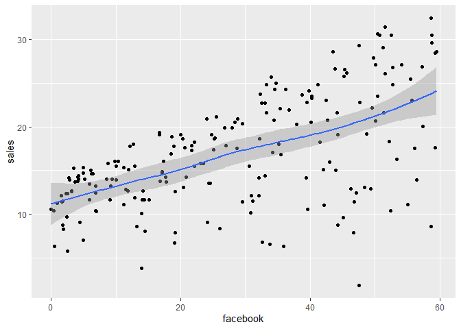<!-- -->

``` r
ggplot(marketing, aes(x = youtube, y=sales)) + geom_point() + stat_smooth()
```

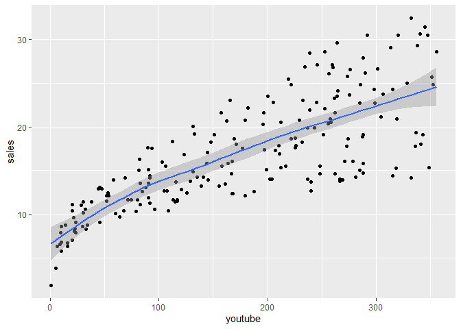<!-- -->

``` r
ggplot(marketing, aes(x = newspaper, y=sales)) + geom_point() + stat_smooth()
```

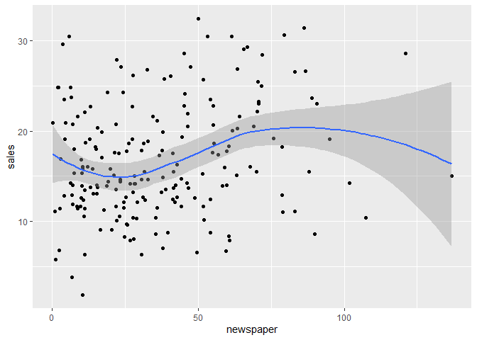<!-- -->

We observe that the Facebook and YouTube advertising budgets shows a
linear trend with sales, whereas newspaper shows a non-linear trend.

We use a correlation matrix to analyse the correlation between all
variables, we notice that YouTube and Sales have the highest
correlation. **Correlation coefficients** can have values ranging from
-1 to +1. -1 or +1 means strong correlation whereas values closer to 0
suggests weaker correlation.

``` r
cor(marketing)
```

    ##              youtube   facebook  newspaper     sales
    ## youtube   1.00000000 0.05480866 0.05664787 0.7822244
    ## facebook  0.05480866 1.00000000 0.35410375 0.5762226
    ## newspaper 0.05664787 0.35410375 1.00000000 0.2282990
    ## sales     0.78222442 0.57622257 0.22829903 1.0000000

### Building the Model

The following steps are applied while building the model:

1.  Split data into training and test data

2.  Train the model on training data

3.  Analysis and Evaluation of the model

4.  Deploy model on test data

Training the model. We use a seed to the random generator so we can get
reproducible results. We then do a 80%-20% split of the data.

``` r
set.seed(123)

training.samples <- marketing$sales %>%  createDataPartition(p=0.8,list=FALSE)

train.data <- marketing[training.samples,]
test.data <- marketing[-training.samples,]
```

To perform a simple linear regression in R, we will use the lm()
function. We chose YouTube as our dependent variable since it had a
linear relationship with Sales and also the highest correlation. This
feature selection method is also known as the **Filter** method where
you drop variables depending on how correlated they are with the output.

``` r
model1 = lm(sales ~ youtube, data = train.data)

model.diag.metrics = augment(model1)

ggplot(model.diag.metrics, aes(youtube, sales)) +  geom_point() +  stat_smooth(method = lm, se = FALSE) +  geom_segment(aes(xend = youtube, yend = .fitted), color = "red", size = 0.3)
```

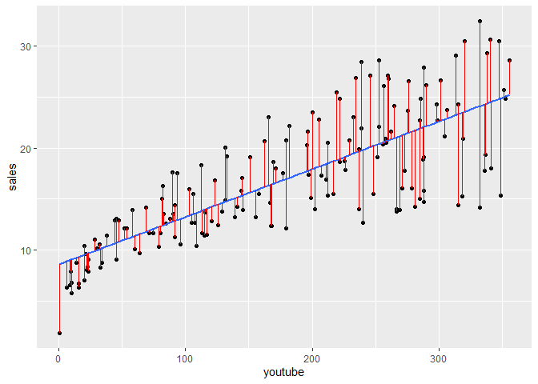<!-- -->

``` r
ggplot(train.data, aes(youtube,sales)) + geom_point() + stat_smooth(method=lm)
```

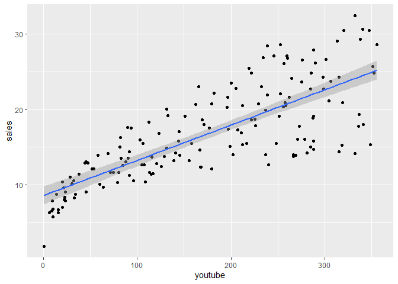<!-- -->

In R, you can easily use the augment() or ggplot() to plot a scatter
plot that plots fitted values and residuals. The red vertical lines are
*residual errors*. Residual errors are the difference in actual and
predicted values.

### Interpreting our regression

``` r
confint(model1)
```

    ##                  2.5 %     97.5 %
    ## (Intercept) 7.37252299 9.80577623
    ## youtube     0.04078498 0.05264781

The Multiple Regression equation is as follows:
***Sales=8.384+0.046*YouTube+ϵ**\*

The intercept (β0) is 8.384 and can be interpreted as the predicted
dollar sales value for a YouTube advertising budget value of zero. So
for a YouTube advertising budget equal to zero, we can expect sales of
8.384\*1000 = \$83,840.

The regression coefficient (β1) shows that for a YouTube advertising
budget equal to 1000 dollars, we can expect an increase of 46 units
(0.046*1000) in sales i.e.sales = 8.384 + 0.046*1000 = 54.38 units. This
represents a sales of \$54,384.

### Hypothesis testing:

Standard errors can be used to perform hypothesis tests on the
regression coefficients. The most common hypothesis test would be
testing the null hypothesis versus the alternative hypothesis.

The null hypothesis (H0): The coefficients are equal to zero i.e., there
is no relationship between the predictor and response variables.

The alternate hypothesis (H1): The coefficients are not equal to zero
i.e., there is a relationship between the predictor and response
variables.

To test the null hypothesis, we have to determine whether our estimate
for β1 is sufficiently far from zero such that β1 is non-zero. If the
standard error of our estimate of β1 is sufficiently small, then even
small values of our estimate of β1 will provide evidence against the
null hypothesis.

How do we measure how far our estimate of β1 is from zero? The
t-statistic will measure the number of standard deviations our estimate
of β1 is away from 0. We need to use the regression model to reject the
null hypothesis and prove there is a relationship between the sales and
YouTube variables.

To interpret our linear regression, we will display a statistical
summary of our model. To do this, we use summary().

``` r
summary(model1)
```

    ## 
    ## Call:
    ## lm(formula = sales ~ youtube, data = train.data)
    ## 
    ## Residuals:
    ##     Min      1Q  Median      3Q     Max 
    ## -9.9409 -2.4546 -0.1483  2.5156  8.7006 
    ## 
    ## Coefficients:
    ##             Estimate Std. Error t value Pr(>|t|)    
    ## (Intercept) 8.589150   0.616044   13.94   <2e-16 ***
    ## youtube     0.046716   0.003003   15.55   <2e-16 ***
    ## ---
    ## Signif. codes:  0 '***' 0.001 '**' 0.01 '*' 0.05 '.' 0.1 ' ' 1
    ## 
    ## Residual standard error: 3.962 on 160 degrees of freedom
    ## Multiple R-squared:  0.6019, Adjusted R-squared:  0.5994 
    ## F-statistic: 241.9 on 1 and 160 DF,  p-value: < 2.2e-16

### Testing the accuracy of our model

Let’s break down this summary output:

***Residuals:*** Residuals are the difference between the actual and
estimated values. The distribution of our residuals should ideally be
symmetrical.

***Coefficients:*** Our coefficients β0 and β1 represent the intercept
and slope respectively. We have already interpreted these coefficients
in the section above.

***The coefficient standard error:*** Measures how much our coefficient
estimates vary from the actual average value of our response variable.
In other words, it measures the accuracy of coefficient estimates. The
closer our standard error is to zero, the better.

***The coefficient t-value:*** Measures how far (in standard deviations)
our coefficient estimate is from 0. A large t-value, relative to
standard error, would provide evidence against the null hypothesis and
indicate that a relationships exists between the predictor and response
variables. Predictors with low t-statistics can be dropped. Ideally, the
t-value should be greater than 1.96 for a p-value to be less than 0.05.

***The coefficient — Pr(\>t):*** Represents the p-value or the
probability of observing a value larger than t. The smaller the p-value,
the more likely we are to reject the null hypothesis. Typically, a
p-value of 5% or less is a good cut-off point. Note the ‘Signif. Codes’
associated to each estimate, in our example. Three asterisks represent a
highly significant p-value. Since the relationship between sales and
YouTube advertising is highly significant, we can reject our null
hypothesis.

***Residual standard error:*** This measures the quality of our
regression fit. It is the average amount the sales variable will vary
from the true regression line.

***Multiple R-squared:*** Besides the t-statistic and p-value, this is
our most important metric for measuring regression model fit. R²
measures the linear relationship between our predictor variable (sales)
and our response / target variable (YouTube advertising). It always lies
between 0 and 1. A number near 0 represents a regression that does not
explain the variance in the response variable well and a number close to
1 does explain the observed variance in the response variable. In our
example, the adjusted R² (which adjusts for degrees of freedom) is
0.5996 — only 59.96% of an increase in sales can be explained by YouTube
advertising. If we perform a multiple regression, we will find that the
R² will increase with an increase in the number of response variables.
The further our F-statistic is away from 1, the better our regression
model. In our example, the F-statistic is 242.1, which is relatively
larger than 1 given the size of our data set (200 observations). The
F-statistic is more relevant in a multiple regression model.

### Asummptions of Linear Regression

Linear Regression has the following assumptions:

***1. Linear Relationship between Independent and Dependent Variable***

***2. Normal Distribution of Residuals ***

***3. Homogeneity of variance (Homoscedasticity)***

***4. Independence of residuals/errors***

A model which has has a high accuracy but violates any of the linear
regression assumptions can produce unreiable results.

``` r
plot(model1)
```

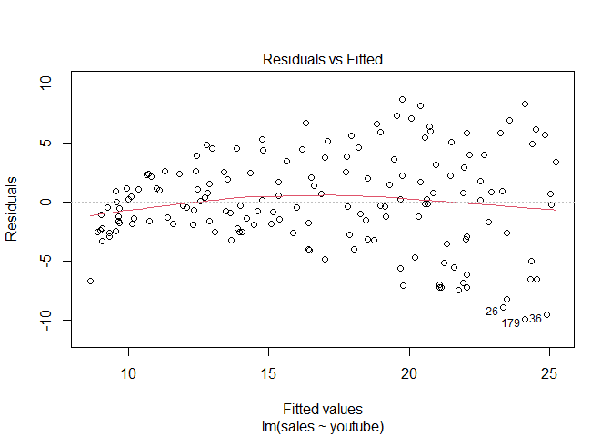<!-- -->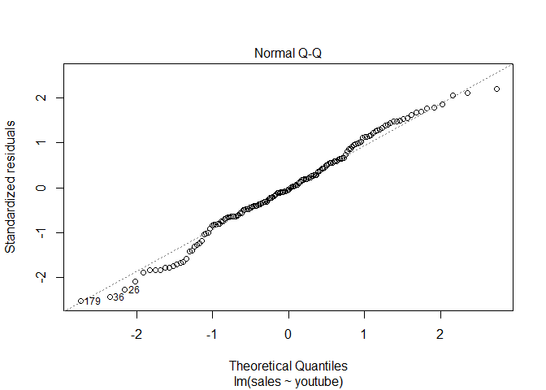<!-- -->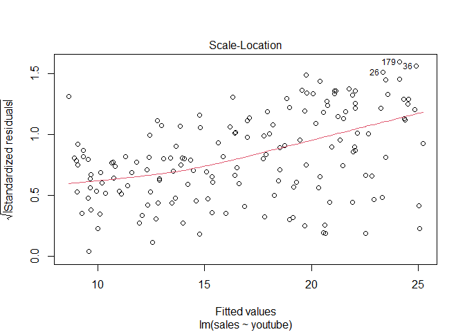<!-- -->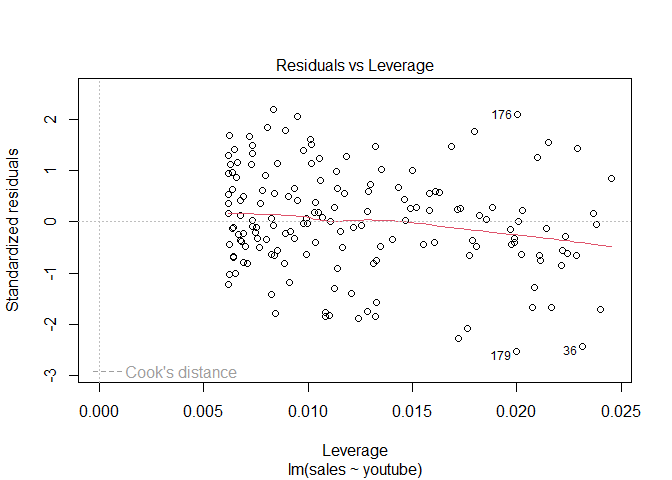<!-- -->

The linear regression model conforms to all of the assumptions, we can
also prove the normality of residuals using the ***Shapiro Test***.

``` r
shapiro.test(model1$residuals)
```

    ## 
    ##  Shapiro-Wilk normality test
    ## 
    ## data:  model1$residuals
    ## W = 0.9889, p-value = 0.2321

Since, the Shapiro test has p-value \> 0.05, we know that the residuals
are normally distributed.

### Multiple Regression

Multiple Regression is used when there are multiple independent
variables in the data and there is a moderate correlation between
independent and dependent variable. We use YouTube and Facebook to
create a linear regression model that can predict sales.

``` r
model2 = lm(sales ~ youtube + facebook, data = train.data)

confint(model2)
```

    ##                  2.5 %     97.5 %
    ## (Intercept) 2.88120236 4.43595670
    ## youtube     0.04159297 0.04770702
    ## facebook    0.17237752 0.20795306

``` r
summary(model2)
```

    ## 
    ## Call:
    ## lm(formula = sales ~ youtube + facebook, data = train.data)
    ## 
    ## Residuals:
    ##      Min       1Q   Median       3Q      Max 
    ## -10.8127  -1.0073   0.3236   1.4643   3.3454 
    ## 
    ## Coefficients:
    ##             Estimate Std. Error t value Pr(>|t|)    
    ## (Intercept) 3.658580   0.393609   9.295   <2e-16 ***
    ## youtube     0.044650   0.001548  28.846   <2e-16 ***
    ## facebook    0.190165   0.009006  21.114   <2e-16 ***
    ## ---
    ## Signif. codes:  0 '***' 0.001 '**' 0.01 '*' 0.05 '.' 0.1 ' ' 1
    ## 
    ## Residual standard error: 2.038 on 159 degrees of freedom
    ## Multiple R-squared:  0.8954, Adjusted R-squared:  0.894 
    ## F-statistic: 680.2 on 2 and 159 DF,  p-value: < 2.2e-16

The multiple regression equation is as follows: ***Sales=3.435+
0.046*YouTube+ 0.187Facebook + ϵ**\*

We also see that the p-value \<0.05 which means we can reject the null
hypothesis which means the variables are significant, we also get a
higher adjuested R² of 88%.

``` r
plot(model2)
```

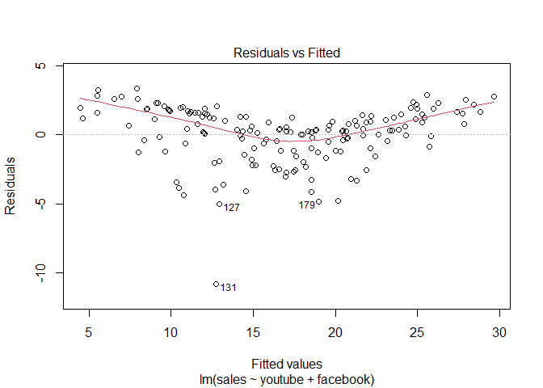<!-- -->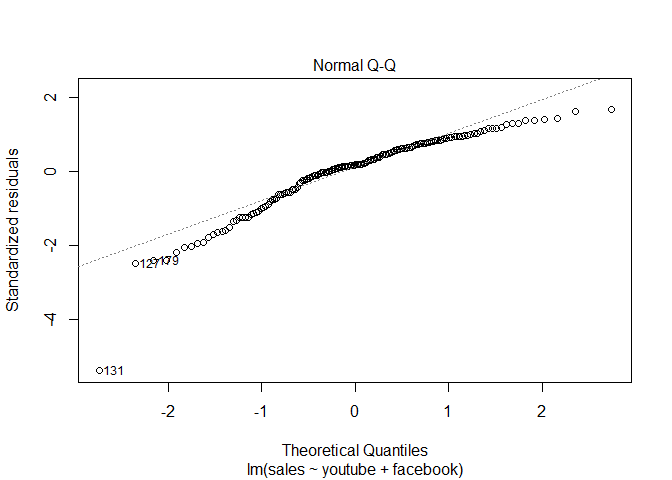<!-- -->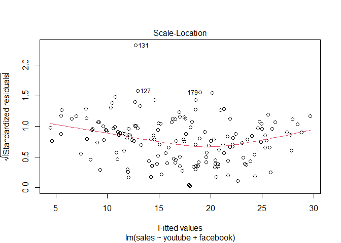<!-- -->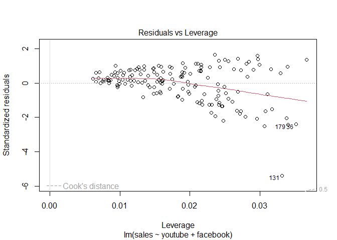<!-- -->

When we look at the QQ plot, we can say that the residuals are not
normally distributed. The residuals are not normally distributed. We
also see from the spread-location graph that that the variability
(variances) of the residual points increases with the value of the
fitted outcome variable, suggesting non-constant variances in the
residuals errors (or heteroscedasticity). According to Shapiro — Wilk
normality test, p value was below 0.05, hence confirmed.

``` r
shapiro.test(model2$residuals)
```

    ## 
    ##  Shapiro-Wilk normality test
    ## 
    ## data:  model2$residuals
    ## W = 0.9055, p-value = 1.026e-08

A possible solution to reduce the heteroscedasticity problem is to use a
log or square root transformation of the outcome variable. We opt for
square root since we have values that are less than 0 which can result
in a negative log transformation.

Let’s build a model with the transformed variable.

``` r
marketing$sqrt_youtube = sqrt(marketing$youtube)


set.seed(123)

training.samples <- marketing$sales %>%  createDataPartition(p=0.8,list=FALSE)

train.data <- marketing[training.samples,]
test.data <- marketing[-training.samples,]

model3 = lm(sales ~ sqrt_youtube+facebook, data = train.data)

shapiro.test(model3$residuals)
```

    ## 
    ##  Shapiro-Wilk normality test
    ## 
    ## data:  model3$residuals
    ## W = 0.98628, p-value = 0.1123

``` r
summary(model3)
```

    ## 
    ## Call:
    ## lm(formula = sales ~ sqrt_youtube + facebook, data = train.data)
    ## 
    ## Residuals:
    ##     Min      1Q  Median      3Q     Max 
    ## -6.6204 -1.0528  0.0447  0.9919  3.9282 
    ## 
    ## Coefficients:
    ##               Estimate Std. Error t value Pr(>|t|)    
    ## (Intercept)  -1.655626   0.433696  -3.817 0.000193 ***
    ## sqrt_youtube  1.047661   0.029289  35.770  < 2e-16 ***
    ## facebook      0.194357   0.007469  26.022  < 2e-16 ***
    ## ---
    ## Signif. codes:  0 '***' 0.001 '**' 0.01 '*' 0.05 '.' 0.1 ' ' 1
    ## 
    ## Residual standard error: 1.692 on 159 degrees of freedom
    ## Multiple R-squared:  0.9279, Adjusted R-squared:  0.927 
    ## F-statistic:  1023 on 2 and 159 DF,  p-value: < 2.2e-16

``` r
plot(model3)
```

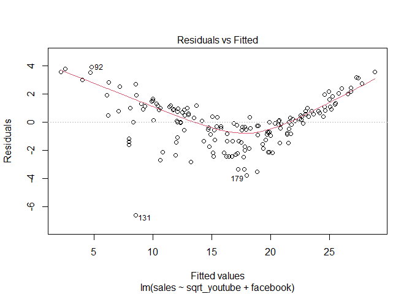<!-- -->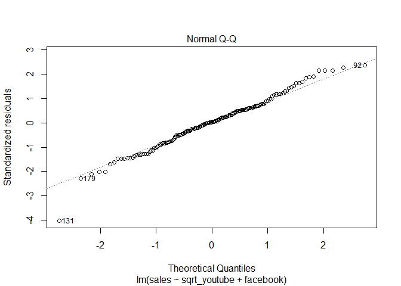<!-- -->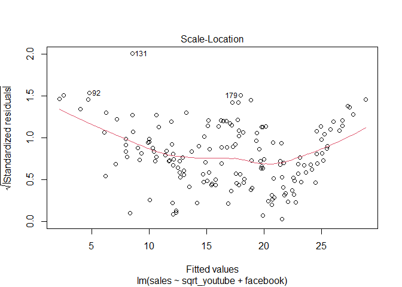<!-- -->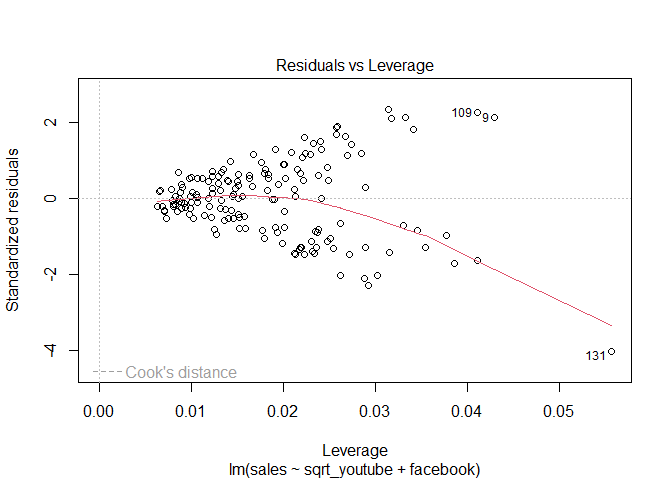<!-- -->
Model 3 residuals are now normally distributed but we see that the
variance of homogeneity is still impaired. Lets remove the 131st
observation which is the outlier value.

``` r
marketing_new = marketing[-c(131),]

marketing_new$sqrt_youtube = sqrt(marketing_new$youtube)

set.seed(123)

training.samples <- marketing_new$sales %>%  createDataPartition(p=0.8,list=FALSE)

train.data <- marketing_new[training.samples,]
test.data <- marketing_new[-training.samples,]

model4 = lm(sales ~ sqrt_youtube+facebook, data = train.data)

shapiro.test(model4$residuals)
```

    ## 
    ##  Shapiro-Wilk normality test
    ## 
    ## data:  model4$residuals
    ## W = 0.99326, p-value = 0.661

``` r
summary(model4)
```

    ## 
    ## Call:
    ## lm(formula = sales ~ sqrt_youtube + facebook, data = train.data)
    ## 
    ## Residuals:
    ##     Min      1Q  Median      3Q     Max 
    ## -4.4780 -1.1588 -0.0103  1.0016  3.7828 
    ## 
    ## Coefficients:
    ##               Estimate Std. Error t value Pr(>|t|)    
    ## (Intercept)  -1.671340   0.413233  -4.045 8.18e-05 ***
    ## sqrt_youtube  1.048031   0.027939  37.512  < 2e-16 ***
    ## facebook      0.194326   0.007085  27.428  < 2e-16 ***
    ## ---
    ## Signif. codes:  0 '***' 0.001 '**' 0.01 '*' 0.05 '.' 0.1 ' ' 1
    ## 
    ## Residual standard error: 1.591 on 158 degrees of freedom
    ## Multiple R-squared:  0.9348, Adjusted R-squared:  0.934 
    ## F-statistic:  1133 on 2 and 158 DF,  p-value: < 2.2e-16

``` r
plot(model4)
```

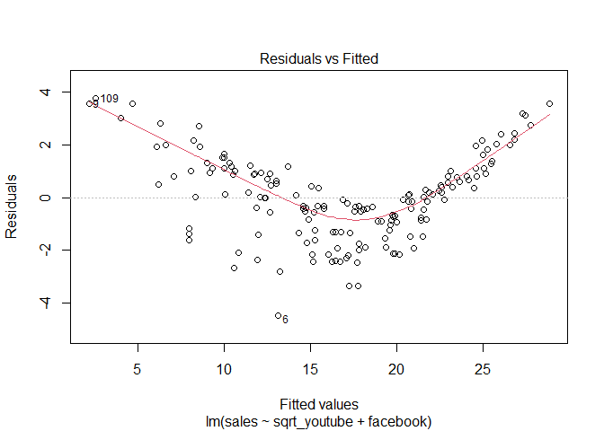<!-- -->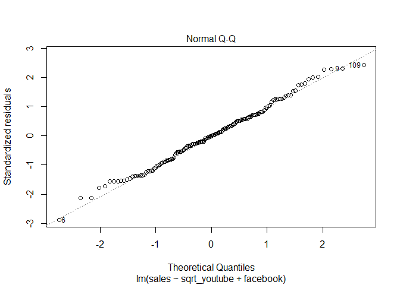<!-- -->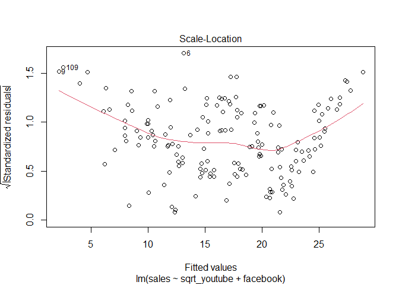<!-- -->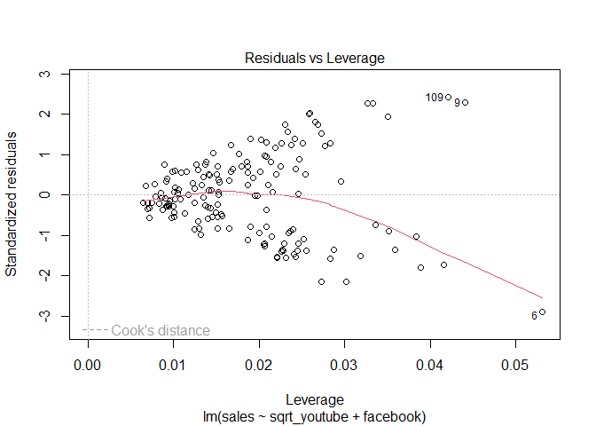<!-- -->

The plot above highlights the top 3 most extreme points (#6, \#9 and
\#109), with a standardized residuals below -3. However, there is no
outliers that exceed 3 standard deviations, that is good.

### Conclusion

Our fourth multiple regression model has a high adjusted R² of 93% and
conforms to all the assumptions of linear regression.
